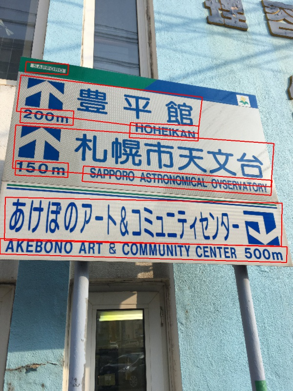
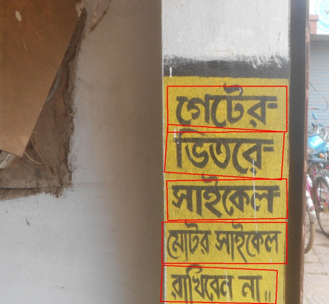
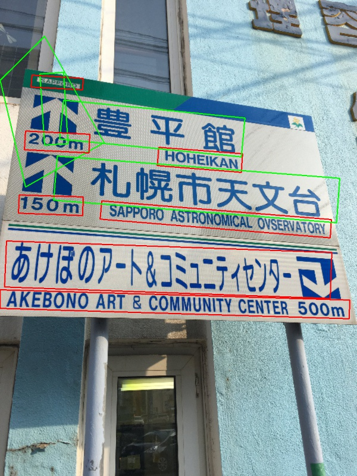
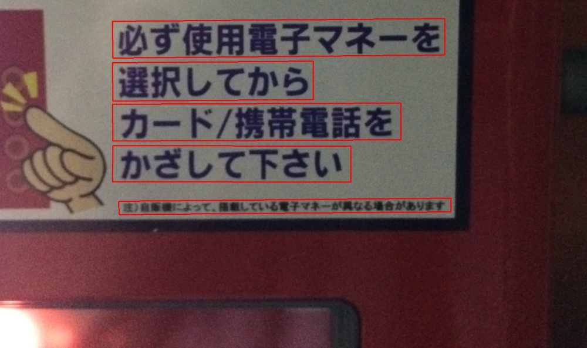

# Test-CTPN
This repo serves as a record of the prcess that I took to test the model illustrated in this paper (https://arxiv.org/abs/1609.03605) and implemented in this repo (https://github.com/YCG09/chinese-ocr/tree/master/ctpn)

## Environment

Training environment was set up in a Gcloud Compute Engine with following sepcs:

+ Ubuntu 16.04
+ Nvidia Tesla P-100, 16 GB memory
+ 64 GB persistent storage
+ 8 CPU cores with 16 GB memory
+ CUDA 8.0
+ CUDNN 6.0
+ Python 3.4
+ Tensorflow 1.3

## General Results
### Pretrained Model

### Manually trained Model
Model is trained using dataset dowloaed from following link(https://drive.google.com/drive/folders/0B_WmJoEtfQhDRl82b1dJTjB2ZGc), and hyperperameters are set according to this file(text.yml)

